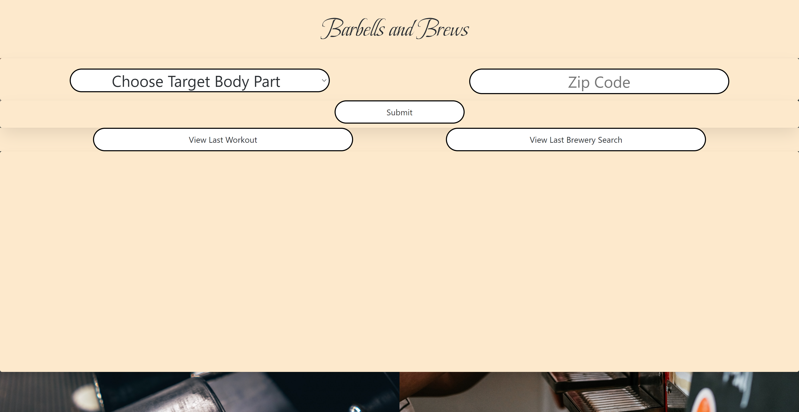

# WorkoutMusicAPI

## Deployed Page: 

### https://simonasnap.github.io/WorkoutMusicAPI/ 

## Description:
Barbells and Brews allows the user to select a target body part and number of desired exercises to generate a random workout, as well as input a zipcode to look up all Breweries in that area.
Once the submit button is pressed the user will get a list exercises with each exercise's name, any equipment that might be needed, as well as a Gif showing what that exercise might look like. In addition, the brewery list that has each brewery's name, address, website url, and phone number.

The user also has an option of calling the last workout or zipcode they generated.

This application satisfies the following requirements:
 - Uses multiple server side APIs
    - Open Brewery DB https://www.openbrewerydb.org/documentation/01-listbreweries
    - ExerciseDB https://www.programmableweb.com/api/exercisedb-rest-api-v10 
 - Uses a CSS framework that is not Bootstrap
    - Bulma https://bulma.io/
 - There is a deployment to GitHub with commits done by all members of the team
    - https://github.com/SimonaSnap/WorkoutMusicAPI 
 - There is a slideshow presentation with a breakdown of our group's process
    - https://docs.google.com/presentation/d/1BUWM0fV0ze3gfxR-ofTBOyAyOZCQFVtw8SF6omv7bWQ/edit?usp=sharing 

Also for wireframing we set up a Figma file that can be found here:
 - Figma: https://www.figma.com/file/fRllO8v1jBevYr6FG79ZaT/Workout-Music-API?node-id=0%3A1 

## What We Learned:
Somethings that our group got to learn or practice are:
 - Calling an API and filtering out the data being requested
 - Adding and calling data to and from localStorage
 - How to use JSON to change array into a string to then add to localStorage
 - A better understanding of the .then in reference to the fetch function
 - Adding an eventListener inside an eventListener
 - Setting up and working with Dropdowns
 - Also split and how that can split strings into usable arrays
 - How to set up a button that can show and hide data
 - How to determine if an API is usable and support the programs that we want to run on it
 - How different CSS frameworks work
 - How to make styling changes as new code is added by others
 - How to read CSS documentation and find key pieces of information

## Screenshot of Deployment:

Copyright (c) 2022 Elizabeth Larson Xavier Marquez Zane Pisano Simona Snapkauskaite

Permission is hereby granted, free of charge, to any person obtaining a copy of this software and associated documentation files (the "Software"), to deal in the Software without restriction, including without limitation the rights to use, copy, modify, merge, publish, distribute, sublicense, and/or sell copies of the Software, and to permit persons to whom the Software is furnished to do so, subject to the following conditions:

The above copyright notice and this permission notice shall be included in all copies or substantial portions of the Software.

THE SOFTWARE IS PROVIDED "AS IS", WITHOUT WARRANTY OF ANY KIND, EXPRESS OR IMPLIED, INCLUDING BUT NOT LIMITED TO THE WARRANTIES OF MERCHANTABILITY, FITNESS FOR A PARTICULAR PURPOSE AND NONINFRINGEMENT. IN NO EVENT SHALL THE AUTHORS OR COPYRIGHT HOLDERS BE LIABLE FOR ANY CLAIM, DAMAGES OR OTHER LIABILITY, WHETHER IN AN ACTION OF CONTRACT, TORT OR OTHERWISE, ARISING FROM, OUT OF OR IN CONNECTION WITH THE SOFTWARE OR THE USE OR OTHER DEALINGS IN THE SOFTWARE.